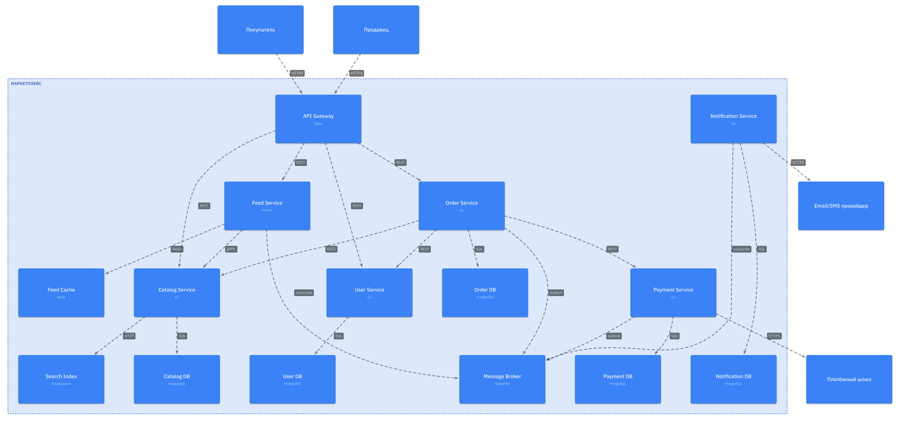
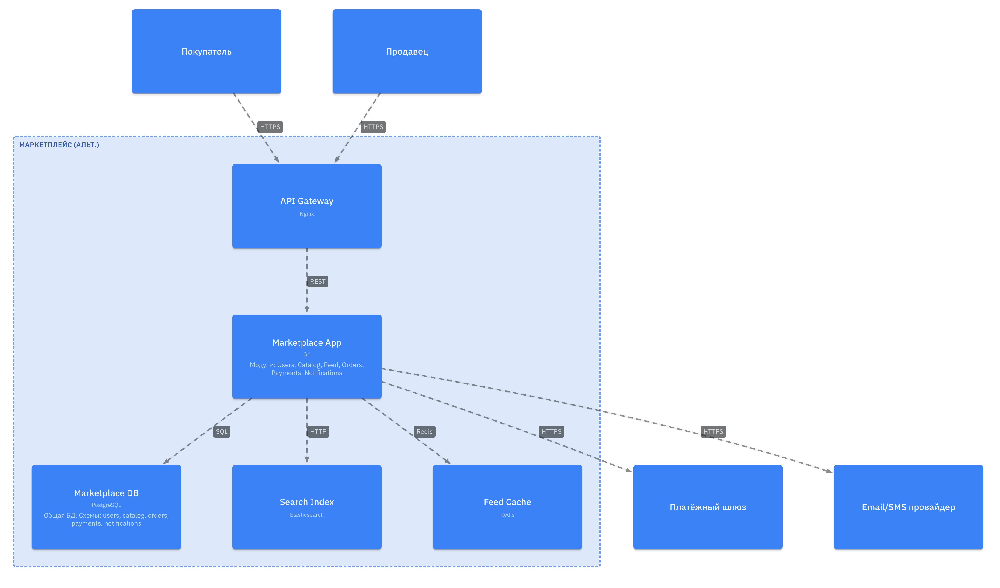
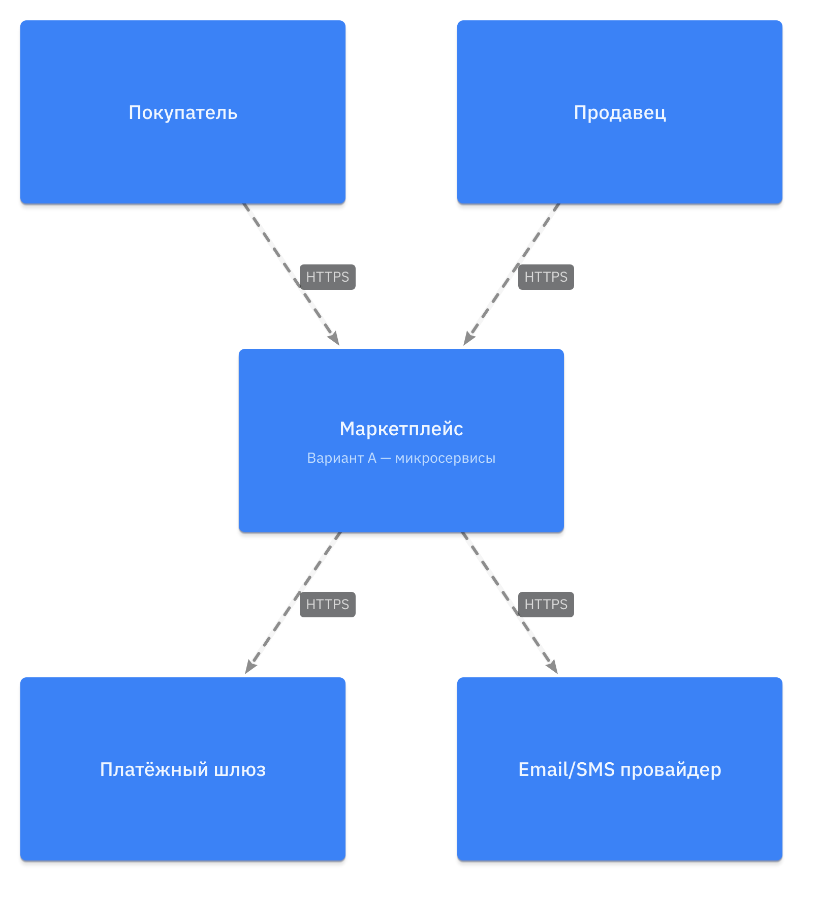

# Архитектура маркетплейса

## 1. Обзор

Начнем описание маркетплейса с основной и финальной архитектуры, разберем ее подробно, а потом перейдем к декомпозиции и трэйд-оффам.

## 2. Домены и зоны ответственности

### 2.1. Домены

| Домен | Зона ответственности |
|-------|---------------------|
| User Management | Регистрация, аутентификация, профили покупателей и продавцов, управление ролями |
| Product Catalog | Создание, редактирование, удаление товаров продавцами, категории, поиск по каталогу |
| Personalization | Формирование персонализированной ленты на основе истории просмотров и покупок пользователя |
| Order Management | Создание заказа, жизненный цикл заказа, история заказов |
| Payment | Расчёт стоимости заказа, инициация платежа через внешний шлюз, учёт транзакций |
| Notification | Отправка уведомлений при смене статуса заказа |

### 2.2. Распределение доменов по сервисам (Вариант A)

Во Варианте A каждый домен вынесен в отдельный сервис со своей базой данных.

| Домен | Сервис | Обоснование                                                                                        |
|-------|--------|----------------------------------------------------------------------------------------------------|
| User Management | User Service | Общая точка регистрации и аутентификации для всех остальных сервисов.                              |
| Product Catalog | Catalog Service | Каталог используется всеми доменами и развивается отдельно, требуется полнотекстовый поиск.        |
| Personalization | Feed Service | Логика персонализации отделена от каталога, использует другой стек и может развиваться независимо. |
| Order Management | Order Service | Сложный жизненный цикл заказа и собственные бизнес‑правила, требует отдельного сервиса и БД.       |
| Payment | Payment Service | Финансовые данные и интеграция с платёжным шлюзом требуют изоляции и отдельного хранилища.         |
| Notification | Notification Service | Асинхронная отправка уведомлений по событиям, отдельный контур ответственности.                    |

### 2.3. Границы владения данными (Вариант A)

| Сервис | Данные | Хранилище |
|--------|--------|-----------|
| User Service | Профили пользователей, credentials, роли | PostgreSQL |
| Catalog Service | Товары, категории, цены, описания, остатки | PostgreSQL + Elasticsearch |
| Feed Service | Поведенческие сигналы, персональные ранжирования | Redis |
| Order Service | Заказы, позиции заказа, история статусов | PostgreSQL |
| Payment Service | Транзакции, методы оплаты, балансы | PostgreSQL |
| Notification Service | Шаблоны уведомлений, история отправок | PostgreSQL |

Разделяемых баз данных нет. Каждый сервис является единственным владельцем своих данных.
Другие сервисы получают данные только через API или события в брокере сообщений.

### 2.4. Взаимодействия между сервисами (Вариант A)

#### Синхронные

| Откуда | Куда | Протокол | Назначение |
|--------|------|----------|------------|
| API Gateway | User Service | REST | Авторизация, получение профиля |
| API Gateway | Catalog Service | REST | Просмотр и управление товарами |
| API Gateway | Feed Service | REST | Получение персонализированной ленты |
| API Gateway | Order Service | REST | Оформление заказа |
| Feed Service | Catalog Service | gRPC | Получение данных о товарах для ранжирования |
| Order Service | User Service | REST | Валидация покупателя |
| Order Service | Catalog Service | REST | Проверка цены и наличия товара |
| Order Service | Payment Service | REST | Инициация платежа |

#### Асинхронные (Message Broker / RabbitMQ)

| Откуда | Куда | Протокол   | Назначение |
|--------|------|--------------------|------------|
| Order Service | Notification Service | RabbitMQ | Уведомление о создании заказа |
| Order Service | Notification Service | RabbitMQ  | Уведомление о смене статуса заказа |
| Payment Service | Order Service | RabbitMQ | Обновление статуса заказа после успешного платежа |
| Payment Service | Order Service, Notification Service | RabbitMQ | Откат заказа и отправка уведомления о неуспешном платеже |
| Order Service | Feed Service | RabbitMQ | Обновление персонализации ленты по завершённому заказу |

## 3. Варианты архитектурной декомпозиции

### Вариант A — Микросервисы (6 сервисов)

Каждый домен выделен в отдельный сервис со своей базой данных.
Взаимодействие между доменами — синхронный REST/gRPC через API Gateway
и асинхронные сообщения через брокер.



### Вариант B — Модульный монолит

Все домены реализованы внутри одного приложения `Marketplace App` как отдельные модули.
Используется общий API Gateway и общая база данных `Marketplace DB`,
а также общие инфраструктурные компоненты Redis и Elasticsearch.



В модульном монолите все шесть доменов представлены как модули внутри `Marketplace App`
(`Users`, `Catalog`, `Feed`, `Orders`, `Payments`, `Notifications`) и работают с общей БД.

## 4. Trade-off

### 4.1. Вариант A — микросервисы

**Плюсы:**

- Независимый деплой и масштабирование каждого домена.
- Лучшая изоляция отказов и данных.
- Возможность подбирать стек под домен.

**Минусы:**

- Более сложная инфраструктура.
- Больше сетевых вызовов и сложнее сквозные транзакции.
- Выше требования к компетенциям команды.

### 4.2. Вариант B — модульный монолит

**Плюсы:**

- Простой деплой и окружение: одно приложение, одна БД.
- Меньше сетевых взаимодействий, проще отладка и мониторинг.
- Сквозные операции укладываются в обычные транзакции БД.

**Минусы:**

- Изменение любого модуля требует выката всего приложения.
- Нельзя масштабировать отдельные домены независимо.
- Слабая изоляция отказов и данных, особенно для платежей.

## 5. Обоснование финального выбора

Выбран Вариант A (6 микросервисов).

1. У разных доменов разная нагрузка. Лента в основном читает данные, платежи в основном пишут данные с жёсткими гарантиями. Их нужно масштабировать отдельно.
2. Платёжный сервис должен быть изолирован из‑за требований безопасности. В варианте B данные по заказам и платежам лежат в одной базе, это хуже с точки зрения защиты.
3. Персонализация использует другой стек. Вариант A позволяет вынести это в отдельный сервис, не усложняя основной код.
4. Важно уметь обновлять части системы независимо. В варианте A можно выкатить новый Catalog или Feed, не трогая Payment. В варианте B любое изменение требует деплоя всего приложения.
5. В задании уже выделено 6 доменов. Каждый из них логично оформить отдельным сервисом — границы ответственности получаются понятными и не пересекаются.

## 6. C4 диаграммы

### Level 1 — System Context



Маркетплейс как единая система. Покупатели и продавцы взаимодействуют через HTTPS.
Система интегрирована с внешним платёжным шлюзом и провайдером уведомлений.

### Level 2 — Container (Вариант A)


### Level 2 — Container (Вариант B)


## 7. Запуск

```bash
docker compose up --build -d
curl http://localhost:8080/health